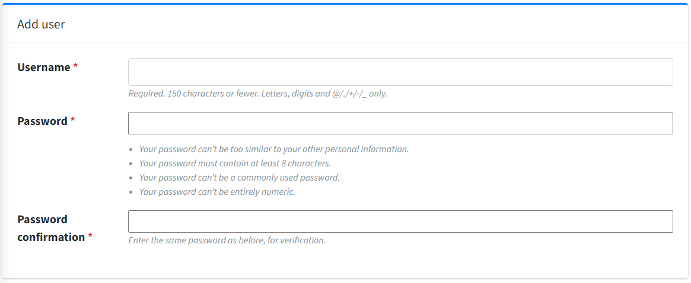
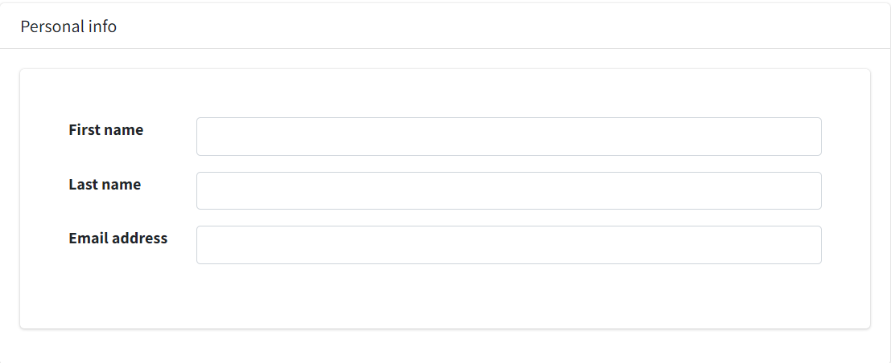
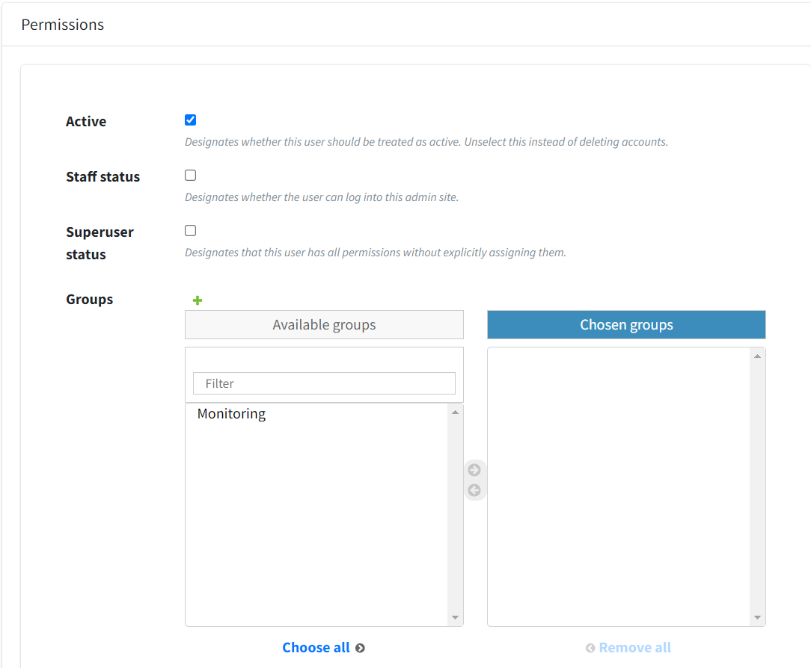
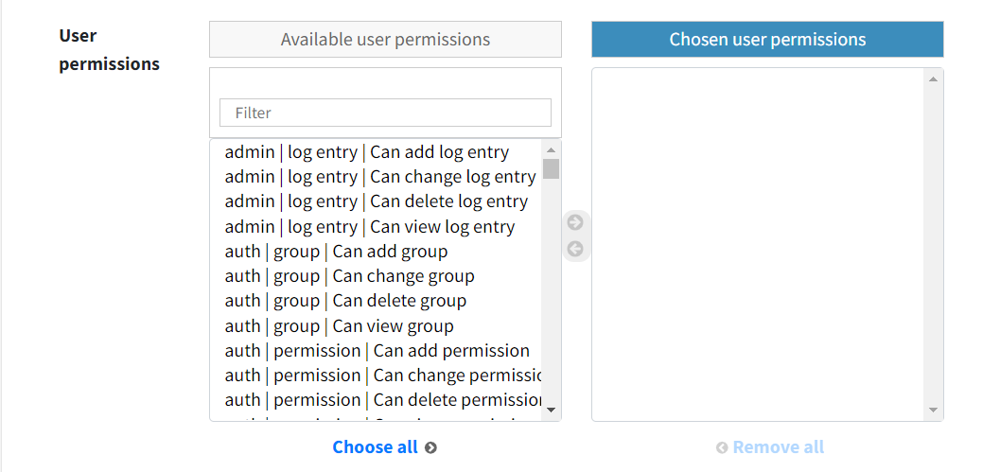

# How to add a new user.

1. In dashboard you find users and just click add 

2. After that, you enter username, password and confirm password

3. You enter personal info about new user

4. Then you choose permissions for this user

5. After all just click save